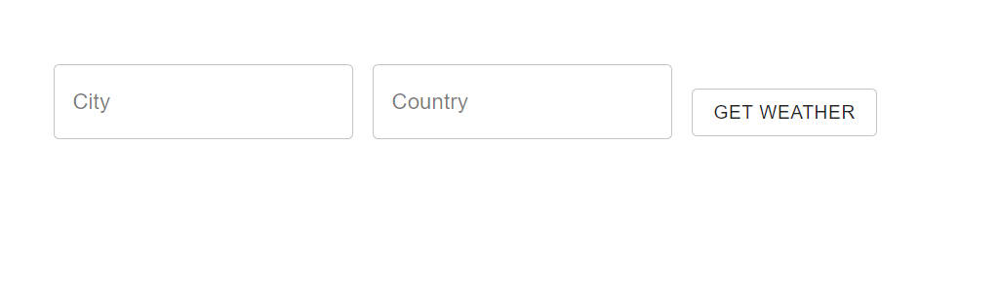
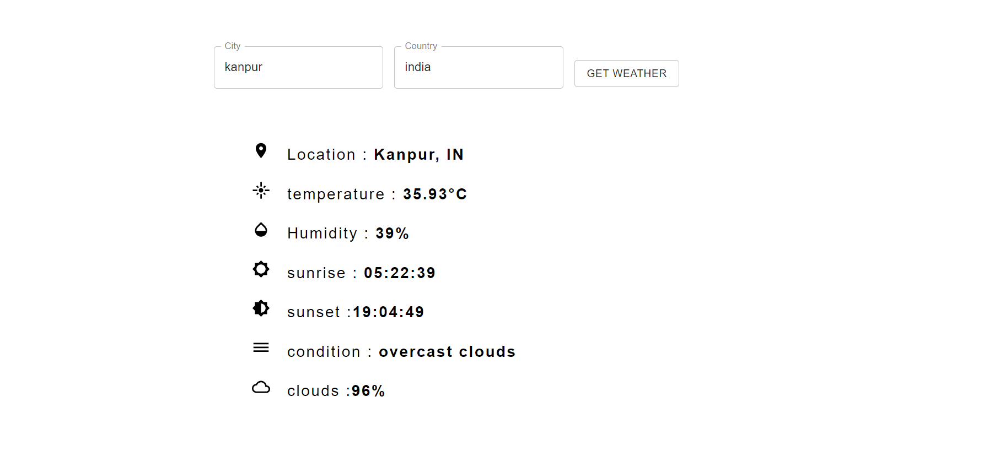

# My Weather App

An App which leverges the openweathermap API to deliver the most recent current weather in your city based on your country.

## How it works

The interface of this app is pretty straightforward and self-explenatory.

<p align="center">
 
</p>

1) Enter your City
2) Enter your Country
3) Hit the **Get Weather** button

that's it 


<p align="center">
 
</p>


## Work on the project locally

In order to work and run the project locally you need NodeJs and npm installed on your system.
Perform the following steps:

```
 $ git clone https://github.com/rohitvish12/weatherapp.git

 $ cd WeatherApp

 $ npm install

 $ npm start
```

After running this commands, open up your favorite browser (if it doesn't open automatically which usually will happen) and go to [http://localhost:3000](http://localhost:3000).

